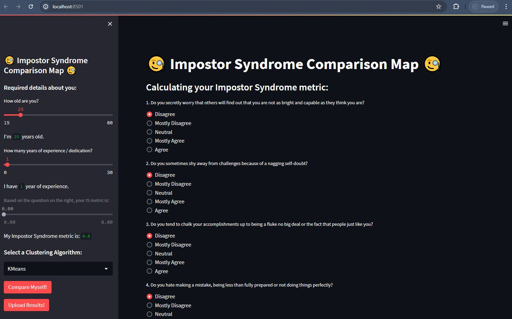

<a name="readme-top"></a>

<!-- PROJECT LOGO -->
<br />
<div align="center">
  <a href="https://github.com/ErnieSumoso/impostor-syndrome-comparison-map">
    
  </a>

<h3 align="center">Impostor Syndrome Comparison Map</h3>
<h2 aling="center">A comprehensive evaluating and visualization tool</h2>

  Impostor syndrome, defined by self-perceived fraudulence, achievement pressure, and negative emotions, creates doubts in one's capacity. This project uses the Young Impostor Syndrome (YIS) scale in a web application to identify symptoms through Likert-scale responses. Users provide personal info, expanding our initial dataset of medical students. We analyze this data using clustering algorithms and present it in 2D/3D scatter plots, highlighting relationships between impostor syndrome traits and demographics. This tool enhances understanding and awareness of impostor syndrome through advanced data analytics and visualizations.
  <p align="center">
    <br />
    <a href="https://github.com/ErnieSumoso/impostor-syndrome-comparison-map/pulls">Pull Requests</a>
    ·
    <a href="https://github.com/ErnieSumoso/impostor-syndrome-comparison-map/issues">Issues</a>
  </p>
</div>


## About The Project

<div align="center">
  
</div>
Initially created as part of the STEM Fellowship 2024 competition, this repository is planned to be a fully fledged application for Impostor Syndrome comparison including multiple visualizations and clustering algorithms
to explore. Individuals are encouraged to provide personal information such as age and years of experience in the field, enabling users to attribute their accomplishments to their own ability. Furthermore, our initial data, from a dataset predicting impostor syndrome in medical students, is processed as the basis for our analysis. This initial data is planned to be expanded with online user responses, using a cloud solution to store their inputs. Users can see where those clusters fit in relation to others by viewing them in 2D and 3D scatter plots. Visualizations help to better understand the frequency and the variability of this mental health phenomenon among demographic groups, in addition to quantifying it.
<p align="right">(<a href="#readme-top">back to top</a>)</p>


### Built With

* [![Python][python-badge]][python-url]
* [![Streamlit][streamlit-badge]][streamlit-url]
* [![JupyterLab][jupyter-badge]][jupyter-url]

<p align="right">(<a href="#readme-top">back to top</a>)</p>


## Getting Started

<!-- TODO -->

### Prerequisites

To run the code you need to have Python installed on your computer and JupyterLab (or Notebook) for visualization and file editing.
* [Python 3+](https://www.python.org/downloads/)
* [JupyterLab 4.0+](https://jupyter.org/install) or Jupyer Notebook

### Installation

1. Clone the repo
   ```sh
   git clone https://github.com/ErnieSumoso/impostor-syndrome-comparison-map.git
   ```
2. Explore the files and enjoy!

<p align="right">(<a href="#readme-top">back to top</a>)</p>


## Usage

<!-- TODO -->

Here are some resources that I use for help:

- [Python 3 Documentation](https://docs.python.org/3/)

<p align="right">(<a href="#readme-top">back to top</a>)</p>


## Roadmap

- [ ] Develop the cloud computing solution using AWS to store the user inputs.
- [ ] Add more clustering algorithms with more parameter options.
- [ ] Enhance and complete the front-end.

I am always open for any suggestions on what exercises to solve. Please, add them on the [issues section](https://github.com/ErnieSumoso/impostor-syndrome-comparison-map/issues).

<p align="right">(<a href="#readme-top">back to top</a>)</p>

<!-- CONTACT -->
## Contact

Ernie Sumoso - [GitHub Profile](https://github.com/ErnieSumoso)

Project Link: https://github.com/ErnieSumoso/impostor-syndrome-comparison-map

<!-- MARKDOWN LINKS & IMAGES -->
<!-- https://www.markdownguide.org/basic-syntax/#reference-style-links -->
[python-badge]: https://img.shields.io/badge/python-3670A0?style=for-the-badge&logo=python&logoColor=ffdd54
[python-url]: https://www.python.org/
[jupyter-badge]: https://img.shields.io/badge/jupyter-book-orange?logo=data:image/png;base64,iVBORw0KGgoAAAANSUhEUgAAABwAAAAZCAMAAAAVHr4VAAAAXVBMVEX////v7+/zdybv7+/zdybv7+/zdybv7+/zdybv7+/zdybv7+/zdybv7+/zdybv7+/zdybv7+/zdybv7+/v7+/zdybv7+/zdybv7+/v7+/zdybv7+/zdybv7+/zdyaSmqV2AAAAHXRSTlMAEBAgIDAwQEBQUGBgcHCAgJCQoLCwwMDQ4ODw8MDkUIUAAADJSURBVHjaddAFkgNBCAXQP+7uAvc/5tLFVseYF8crUB0560r/5gwvjYYm8gq8QJoyIJNwlnUH0WEnART6YSezV6c5tjOTaoKdfGXtnclFlEBEXVd8JzG4pa/LDql9Jff/ZCC/h2zSqF5bzf4vqkgNwEzeClUd8uMadLE6OnhBFsES5niQh2BOYUqZsfGdmrmbN+TMvPROHUOkde8sEs6Bnr0tDDf2Roj6fmVfubuGyttejCeLc+xFm+NLuLnJeFAyl3gS932MF/wBoukfUcwI05kAAAAASUVORK5CYII=
[jupyter-url]: https://jupyter.org/
[streamlit-badge]: https://img.shields.io/badge/-Streamlit-61DAFB?style=plastic&logo=streamlit
[streamlit-url]: https://docs.streamlit.io/
